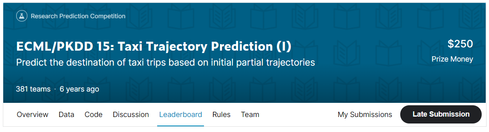
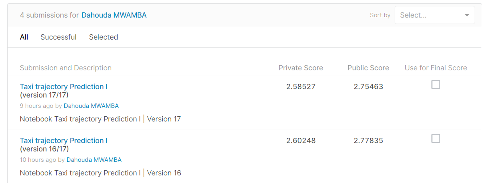
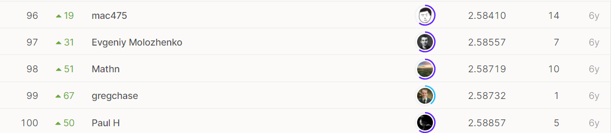

# ECML/PKDD 15: Taxi Trajectory Prediction (I)

## 결과

### 요약정보

- 도전기관 : 한양대학교
- 도전자 : MWAMBA KASONGO Dahouda
- 최종스코어 : 2.58527
- 제출일자 : 2021-06-09
- 총 참여 팀 수 : 381
- 순위 및 비율 : 97(25.46%)

### 결과화면

## 사용한 방법 & 알고리즘

간단한 뉴럴 네트워크 모델을 사용했습니다.

In this challenge, the gaol is to build a predictive framework that is able to infer the final destination of taxi rides in Porto, Portugal based on their (initial) partial trajectories. The output of such a framework must be the final trip's destination (WGS84 coordinates). 
The LATITUDE/LONGITUDE represent the location's coordinates (using WGS84 format) of our predicted destination.

---  Problem of Multioutput Regression

Multioutput regression are regression problems that involve predicting two or more numerical values given an input example.

Some regression problems require the prediction of two or more numeric values. For example, predicting an x and y coordinate.

These problems are referred to as multiple-output regression, or multioutput regression.

*** Regression: Predict a single numeric output given an input.

*** Multioutput Regression: Predict two or more numeric outputs given an input.

1. Loarding The Data
2. Exploratory Data Analysis

    Time series visualization
3. Data Preprocessing

    Training Dataset preprocessing
    Testing Dataset preprocessing
4. Building Machine Learning Models

    4.1 MultiOutputRegressor - Random Forest Regressor

    4.2 MultiOutputRegressor - Gradient Boosting Regressor

    4.3 MultiOutputRegressor - Linear Regression

    4.4 MultiOutputRegressor - k-Nearest Neighbors Regressor

    4.5 MultiOutputRegressor - Decision Tree Regressor

## 코드

[`./taxi-trajectory-prediction-i.ipynb`](./taxi-trajectory-prediction-i.ipynb)

## 참고 자료

- [How to Develop Multi-Output Regression Models with Python](https://machinelearningmastery.com/multi-output-regression-models-with-python/)
