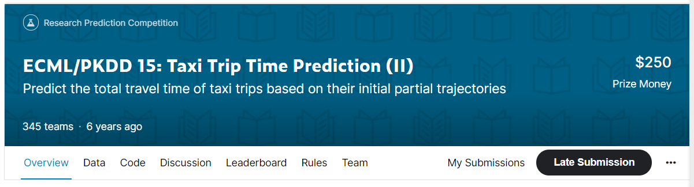
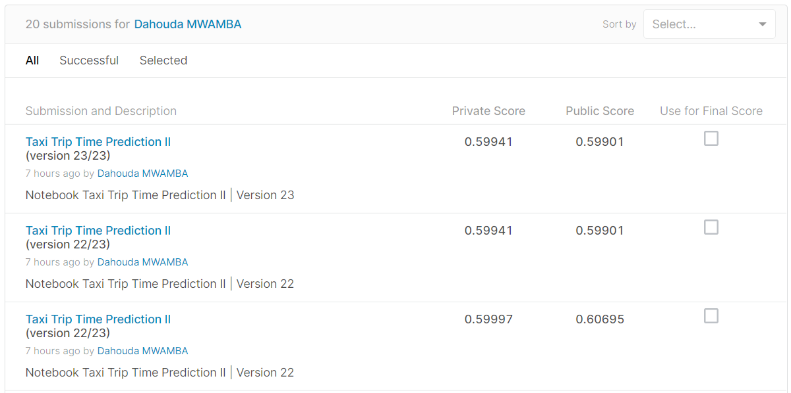
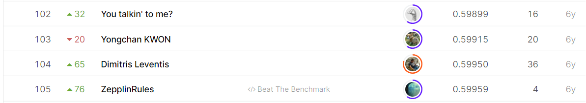

# ECML/PKDD 15: Taxi Trip Time Prediction (II)

## 결과

### 요약정보

- 도전기관 : 한양대학교
- 도전자 : MWAMBA KASONGO Dahouda
- 최종스코어 : 0.59941
- 제출일자 : 2021-07-16
- 총 참여 팀 수 : 345
- 순위 및 비율 : 104(30.14%)

### 결과화면

## 사용한 방법 & 알고리즘

간단한 뉴럴 네트워크 모델을 사용했습니다.

In this challenge, we ask you to build a predictive framework that is able to infer the trip time of taxi rides in Porto, Portugal based on their (initial) partial trajectories. The output of such a framework must be the travel time of a particular taxi trip.

---  Evaluations
Submissions are evaluated one the Root Mean Squared Logarithmic Error(RMSLE).
Compute the Haversine distance between samples in X and Y.
   As the Earth is nearly spherical, the haversine formula provides a good approximation of the distance between two points of the Earth surface, with a less than 1% error on average.

1. Loarding The Data
2. Exploratory Data Analysis

    Time series visualization
3. Compute the Haversine distance

    
4. Make Predictions

## 코드

[`./taxi-trip-time-prediction-ii.ipynb`](./taxi-trip-time-prediction-ii.ipynb)

## 참고 자료

- [Haversine distance between 2 points X and Y](https://scikit-learn.org/stable/modules/generated/sklearn.metrics.pairwise.haversine_distances.html)
